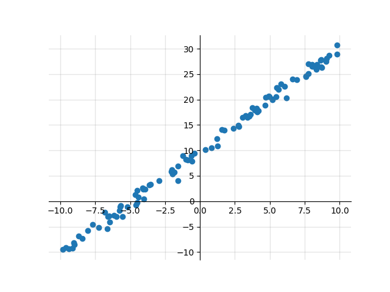
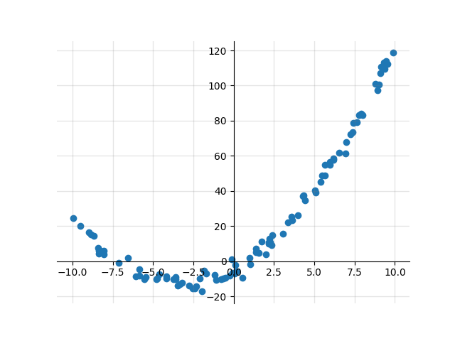
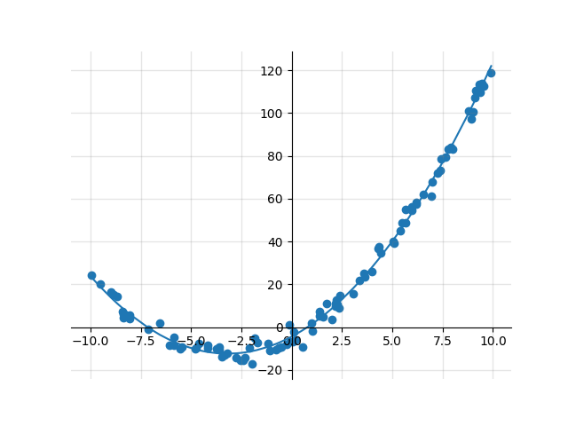
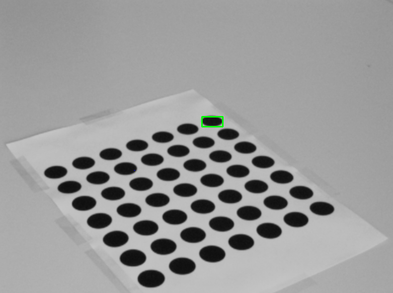
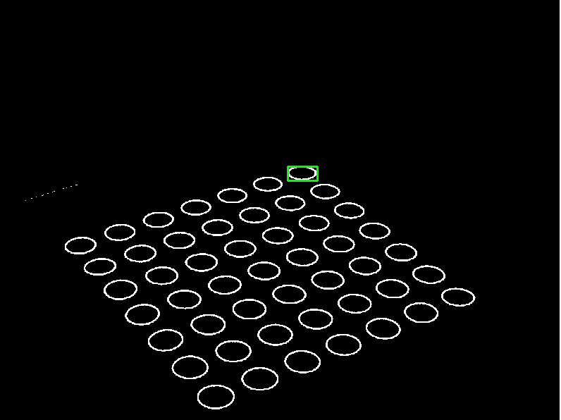
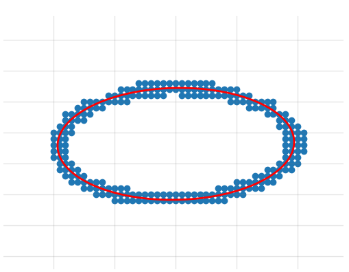
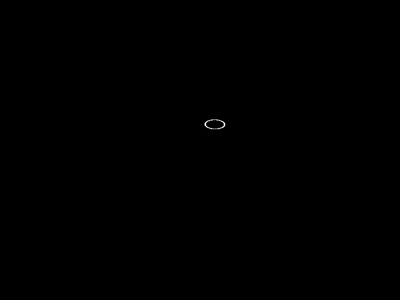

# Curve Fitting

Implementations of least squares parameter estimation for linear and quadratic regression as well as ellipse fitting

## Linear and Quadratic Regression

Module providing functions to perform linear and quadratic regression on multivariate data.

### src/regression.py:

Provides the functions for regression as well as data generation

__generate_datapoints(number_dp, dim_x, start=0, end=1, func=(lambda x: x), noise=1):__

Generate ``number_dp`` datapoints (x,y) with x being a vector containing ``dim_x`` random elements drawn from the interval [start, end) and y being a scalar obtained by evaluating the expression func(x) and adding gaussion distributed noise with parameters mean = 0 and std = ``noise``

__LSRegressionLinear(X, y):__

Performs linear regression

__LSRegressionQuadratic(X, y):__

Performs quadratic regression

### examples_regression.py:

Contains examples in which data is generated using a linear / quadratic model and then regression is performed to retrieve the original function parameters. Multivariate regression is also included in the example scripts, but not discussed here in the README, as it is not as pretty to visualize the data and the obtained model.

#### Linear Regression Univariate

First we create a dataset containing 100 samples from the interval [-10, 10] that follow the linear model f(x)=2*x+10+E where E ~ N(0,0.8). That means we add a gaussian distributed error with mean = 0 and standard deviation (STD) = 0.8.

Now we can perform regression, which gives us a parameter estimation for our linear model based on the data that we generated. It uses Least Squares estimation to obtain the most well-fitting set of parameters. In my specific run I obtained the estimations [2.019011, 9.87388536], which lies rather close to the actual ones. The additive error is present in our data as well, when we look at the Mean Squared Error (MSE) we should find a number close to our STD squared. In my example, the MSE is ~0.664, which is close to 0.64 (0.8 squared).

#### Quadratic Regression Univariate

Again, we first create our data of a 100 random samples from the interval [-10, 10]. But this time we create our data values from these samples using a quadratic model f(x)=0.8*x^2+5*x-5+E with E ~ N(0,3).

Then we perform regression to determine the parameters of our quadratic model. My test run estimated the following parameters: 
[0.78126571, 4.99260825, -4.40157621]
Again, rather close to the producing model, but this time the error was a bit higher. This was because my additive error component had a much higher STD this time. The MSE was 7.967, which again is close to 9, the STD squared.

## Ellipse Fitting

Functions for Least Squares Estimation of Ellipse Parameters. 

To fit the parameters of an ellipse to a given set of points, we first of all need to identify the points to fit.
When working on images, one possibility may be to generate a binary image using adaptive thresholding, and then analyzing
the image for connected components:

Now that we know which points to fit, we have different possibilities to model our ellipse and estimate the model's parameters.
One implementation uses the equation a*x^2 + b*xy + c*y^2 + d*x + e*y + f = 0 with the constraint b^2 - 4ac = -1. This results
in a generalized eigenproblem which is solved using the qz factorization:

With the ellipse parameters estimated, we can precisely calculate the position in the image by evaluating the equation for every pixel.
Pixels that result in residuals smaller than a given epsilon (so close to zero) form the ellipse:

